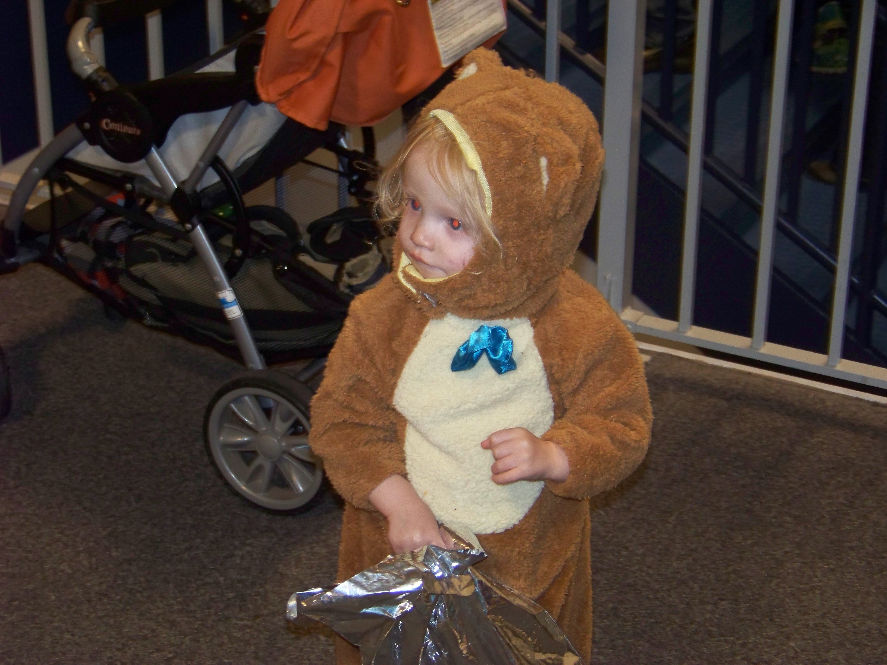

# [Cyberland](http://cyberland.tenderapp.com/discussions/cyberland)/

#Boo Bash 2014

The Boo Bash for this year was held at the Sports Complex in Mount Pleasant. Kids were invited to attend wearing their Halloween costumes. There was free candy, and the ice arena hosted a Halloween themed open skate.

[Image: https://quip.com/-/blob/6j1MhISJdKMC2DnkThi2lA]

On Saturday, October 25, 2014, the ICE Arena and Morey Courts held their annual Boo Bash. We took all three of our kids there in costume. Kayla was dressed as a ladybug, Josh went as Spider-Man, and Elijah was dressed as a bear.

During previous years, we’ve waited a long time to get into the event, but this year the line was a lot shorter and moved quicker. It might have helped that we arrived before five o’clock. I think that a bigger crowd gathered around 5:30 p.m. I’m also wondering if the great weather we had all day long (60 degree weather) had something to do with it. Perhaps people just didn’t want to spend their evening indoors.

Kayla went directly into the ICE Arena where she was going to participate in that night’s Halloween-themed open skate. The boys and I headed straight up to the second level of Morey Courts. Because we had Elijah’s stroller, we were routed to an elevator where we could easily reach the upper floor. Everybody else flowed up the stairs.

It was great to be able to go up with the stroller, but then it was a little awkward trying to get back into line. It was like having to give up our place in line so that we could look like total jerks attempting to cut back into line. Another father who we had followed into the elevator also had a stroller. I asked him what the proper etiquette was for getting back in line, and he said that he was looking for the approximate point where he had left the line. This seemed pretty fair. I watched for familiar until an opportunity seemed to present itself.

As we were inching our way into line, a volunteer asked us if we had been in line, and I explained that I had needed to go up in the elevator because of our stroller. I bit my tongue, hoping that she wasn’t going to challenge our right to retake our spot. She didn’t say anything else.

Josh, eleven, pretty much knew what to do. Elijah had absolutely no interest in staying in line, although he gratefully accepted offers to pick out candy. He picked a Butterfinger out of one of the table’s pot of candy, and then wouldn’t give it up for anything. Eventually, I was able to distract him with a frisbee, but he fussed when I scooped up the butterfinger.

There were a number of costumed characters floating around the space where the candy was being given out. Elijah was fascinated by them, but still seemed a little leery. He offered one of them the frisbee we had picked up at one of the tables.

Elijah’s favorite treat was a bag of animal crackers. He wanted the bag opened as soon as I showed it to him. At first, he was kind of moving the animals around, but eventually he began to eat them. Meanwhile, Kayla was enjoying her time on the ice.

[_View Online_](https://docs.google.com/document/d/1HtEYdEiZ73sRgrnsxn6XdV4hE8Qr3C5EiWYTJ9_MilI/edit?usp=sharing) / [_Share your Story_](http://cyberland.tenderapp.com/discussions/cyberland)

